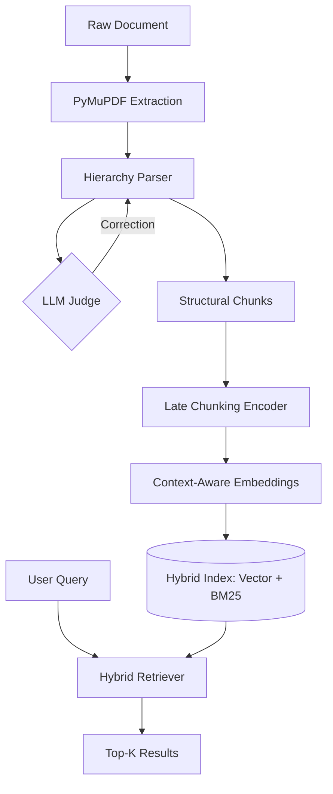

# LumenParser: Advanced High-Fidelity Retrieval Pipeline

**LumenParser** is a sophisticated RAG (Retrieval-Augmented Generation) toolkit designed to solve the twin pillars of retrieval failure: **unstructured document noise** and **contextual loss in chunking**.

Unlike standard RAG implementations that rely on naïve recursive splitting, LumenParser uses an agentic structural correction layer combined with state-of-the-art Late Chunking to ensure that every retrieved segment is both structurally accurate and contextually rich.

---

## 🚀 Key Features

### 1. Agentic Hierarchy Parsing
Most RAG failures stem from messy source documents where headers and sections are inconsistent. LumenParser implements an **LLM-in-the-loop structural correction** layer:
*   **Dynamic Scanning**: Parses document headers (Markdown/PDF) to build a logical tree.
*   **Agentic Rectification**: Uses a Google Gemini agent to analyze the document structure, proposing fixes for broken hierarchies (e.g., misaligned H3s under an H1).
*   **Structural Context**: Segments are bound to their parent sections, ensuring that local data always carries its global metadata.

### 2. Context-Sensitive Late Chunking
Traditional chunking breaks a document into isolated pieces, causing the embedding model to lose the broader context of a paragraph. LumenParser implements **Late Chunking**:
*   **Whole-Document Pooling**: The entire document is passed through the transformer model (e.g., Jina-v3 or Qwen-0.6B) in a single pass.
*   **Span-Level Pooling**: Embeddings are generated for specific text spans *after* the model has "seen" the surrounding context.
*   **High Semantic Fidelity**: This ensures that a chunk about "implementation details" knows exactly *which* feature it is detailing based on its position in the document flow.

### 3. Custom Embedding Integration Layer
LumenParser doesn't just use default database wrappers. It implements a **Custom Transformers Embedding Layer** bridged with ChromaDB:
*   **Plug-and-Play Models**: Custom `EmbeddingFunction` wrappers for specialized models like `jinaai/jina-embeddings-v3` and `Qwen/Qwen3-Embedding-0.6B`.
*   **Optimized Ingestion**: Seamlessly handles document-to-embedding mapping during the vector ingestion phase.
*   **Extensible Design**: The architecture allows for switching between local transformer models and API-based models with zero downtime to the main pipeline.

### 4. Weighted Hybrid Retrieval
To ensure both conceptual accuracy and keyword precision, LumenParser utilizes a custom hybrid retrieval strategy:
*   **Dense Search**: Semantic similarity using context-aware late chunked embeddings.
*   **Sparse Search**: Keyword-based retrieval using the BM25S algorithm.
*   **Custom Re-ranking**: A weighted scoring system (`semantic_weight` vs `bm25_weight`) to optimize results for specific domain requirements.

---

## 🛠 Tech Stack

*   **Language Models**: Google Gemini 2.5 Flash, Qwen-3-Embedding.
*   **Embedding Framework**: Hugging Face Transformers, Jina AI (Late Chunking strategy).
*   **Retrieval**: BM25S (Sparse), Vector-based Cosine Similarity (Dense).
*   **Parsing**: PyMuPDF4LLM for high-quality Markdown extraction from PDFs.
*   **Core Logic**: Python 3.10+, Pydantic for schema validation.

---

## 📋 Architecture



---

## 🚦 Getting Started

### Installation
```bash
pip install -r requirements.txt
# Requirements include: transformers, bm25s, google-genai, pymupdf4llm, pydantic
```

### Running Tests
The project includes a comprehensive test suite in `processing/chunking/test/test_lc.py` showcasing the unified retrieval capability.

```bash
python3 -m unittest processing/chunking/test/test_lc.py
```

### Example Usage
```python
from processing.chunking.late_chunking import LateChunking

late_chunk = LateChunking()
late_chunk.chunk_text("Your document text here...")

# Perform Hybrid Retrieval
results, semantic_count, bm25_count = late_chunk.retrieve(
    query="What are the core technical specs?", 
    top_k=5,
    semantic_weight=0.8
)
```

---

## 💡 Why This Matters
This project demonstrates a production-grade approach to RAG where **data engineering** (hierarchy parsing) meet **algorithmic innovation** (late chunking). It moves beyond basic RAG to build a system that understands *where* a piece of information sits in a document and *why* it is relevant.